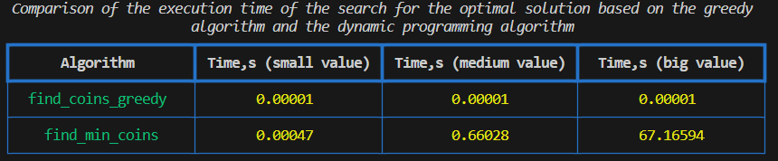

# Висновок:

в даній роботі було проведено дослідження жадібного алгоритму та алгоритму динамічного програмування для визначення оптимально розподілу монет та часу їх виконання для різних вхідних даних. Вхідні дані було розділено на незначні значенн (113), середні (113038) та великі (11308378)
На основі дослідження можна сказати, що:

- з наведних в таблиці результатів роботи жадібного алгоритму та алгоритму динамічного програмування можна побачити, що жадібний алгоритм показує найкращий результат по часу виконання (практично незмінний час для всіх проведених експериментів), в порівнянні з алгоритмом динамічного програмування

- зважаючи на природу жадібного алгоритму, тобто вибору найкращих локальних варіантів, можуть виникнути ситуації коли важливою є точність обчислень. В даному випадку перевагу слід надати алгоритму диначіного програмування, який, не завжаючи на значні затрати ресурсів, як часових так і просторових, надась бажаний результат.

- було також визначено різницю результатів жадібного алгоритму та алгоритму динамічного програмування для конкретного експерименту. Оскільки різниця у всіх трьох випадках становить 0, то можна сказати про правильність обрахунків обох алгоритмів.

        {50: 0, 10: 0, 2: 0, 1: 0}
        {50: 0, 25: 0, 10: 0, 2: 0, 1: 0}
        {50: 0, 25: 0, 2: 0, 1: 0}

Виходячм з вищесказаного, безперечно, можна вибрати жадібний алгоритм, як найкращий інстумент для розвязку подібних задач. Однак, кожна окрема задача потребує всебічного критичного дослідження та вибору оптимального алгоритму.
